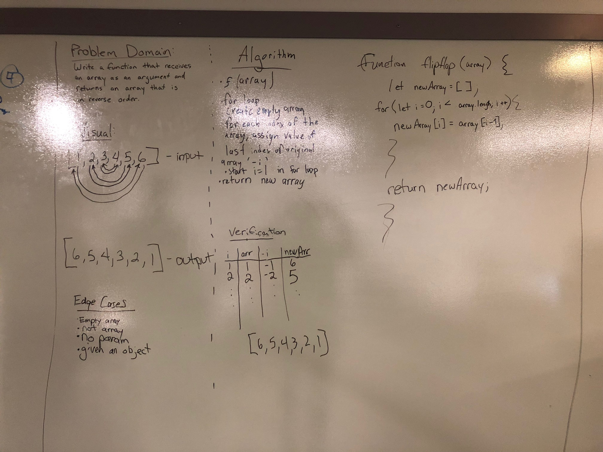

# Reverse an Array

## Challenge
The challenge was to write a function that takes in an array as a parameter and reverses that array.

## Approach & Efficiency
Jake came up with a really good, simple solution for this challenge using negaitve indexes. Since we couldn't use any array methods to solve this problem, we decided to first create an empty array named newArray. Then, we looped through each term in the array assigning the value of that index in the new array to the value of the (-i-1) of the original array. We needed to subtract one since the negaitve value of 0, would be 0 and we needed the final term not the 0 term.

This method didn't quite work once we tested it on a computer since you can't use negative indexes like that apparently, so instead I made a simple adjustment: I replaced the negative index with array.length-i-1 (to get me the last value). This would move backwards through original array assigning each value forwards in the new array.

## Solution
