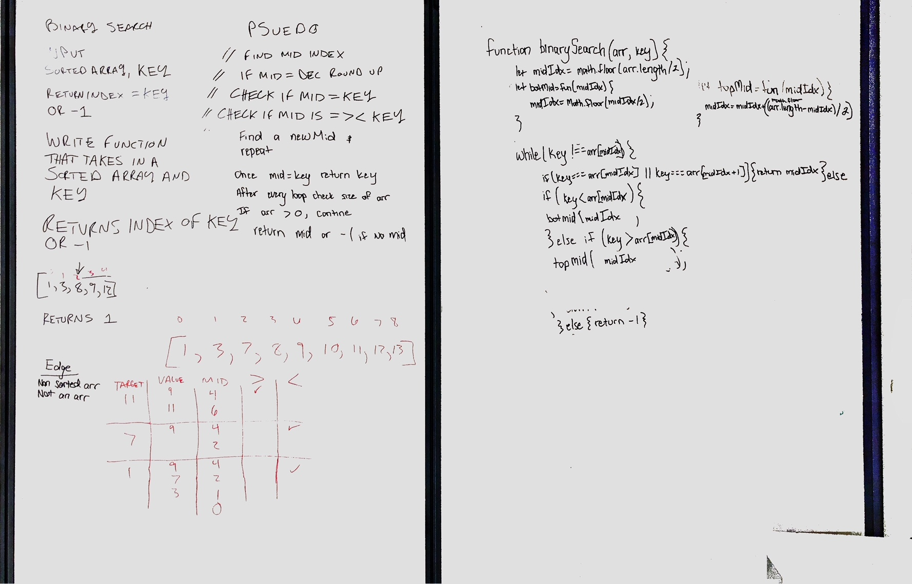

# Binary Search
A function that creates a binary search

## Challenge
The challenge was to write a function that given a sorted array and a key, produces the index of the array value that matches the key.

## Approach & Efficiency
My partner, John, and I decided to cut the array in half each time testing to see if the key matched the value of the middle position. If it was too big, we ran a function that cut the array in half again on the top half. If it was too small, we cut the array in half again on the bottom. We repeated this process until we found the index value of the key.

## Solution

