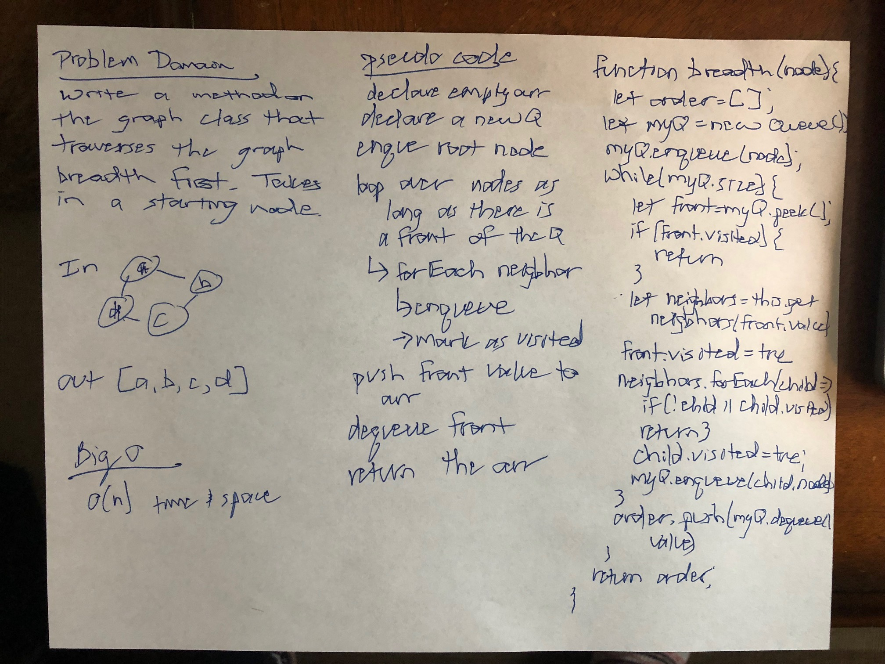

# Breadth-First Traversal of a Graph

## Challenge
Write a method that traverses a graph and outputs the values of each node into an array

## Approach & Efficiency
I used a Queue. First I enqueued the starting node. Then I enqueued all of its neigbhors. Then I pushed it's value into an array before deququing it. I continued this process until there was no longer a front node in my Queue.

## Solution
;
