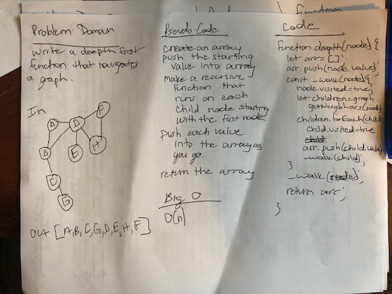

# Depth First Traversal

## Challenge
write a funcation that takes in aa starting node and traverses the graph deapth first returning an array of all the nodes visited

## Approach & Efficiency
I chose to use a recursive function to solve this problem. First I push the value of the starting node into the array. Then, I create a recursive function that visits every neigbhor of the node and runs again pushing the value of the node into the array each time. This would produce an O(n) for time and space.

## Solution

