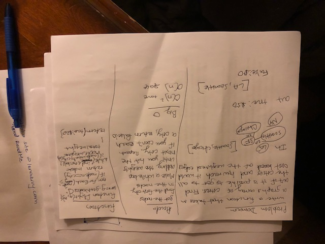

# Find Edges

## Challenge
Write a function that given a graph and an array of cities determines if it is possible to travel to each city in the array and if so how much it would cost (the total weight of the edges to do this). 

## Approach & Efficiency
First, I got a list of all the nodes using the GetNodes method on the graph. Then I set up a while loop to repeat for as long as the current city name is not equal to the last name in the city array (destination city). Once I'm in the while loop, I run a for loop through all the nodes in the graph to see if the current city is in the node list. If it is, I set the current city to that node. Now that I have the city node, I find all the neigbhors to that city node and loop through them to see if the next city in my city list is in my neigbhor's list. If it is, I add the weight to a total weight variable and move the current city to the next next city to repeat that loop. If it isn't, I can just return false because that means that it is impossible to travel between those two cities.

## Solution

