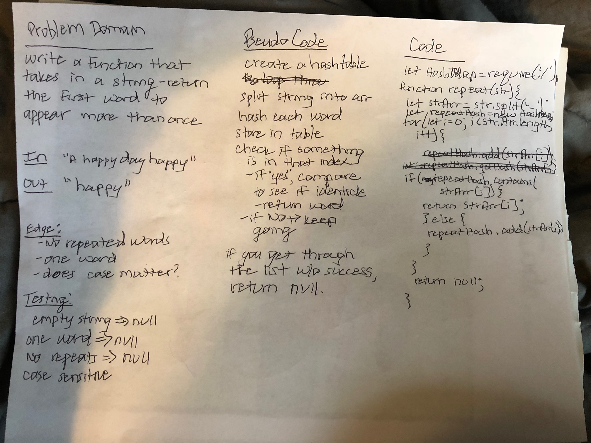

# Hashmaps/ Hashtables
An O(1) way to store and find information

## Author Lena Eivy

## Challenge
The challenge was to write a class called HashMap that takes in a number to dertime the size of the HashMap. The class has the following functions:

* getHash(key): this function hashes the key and returns an int between 0 and the size of the hashmap
* add(key, value): this function adds the key value pair to the hashmap using the getHash
* find(key): this funciton returns the value of a given key
* contains(key): this funciton returns true if a key exists in the hashmap and false if the key does not exist in the hashmap

## Approach & Efficiency
* getHash(key): This is a simple formula that can be modified to turn the key into a number between 0 and the size. This is an O(1) for both time and space

* add(key, value): This function takes a key and runs getHash on it to find an index position and then puts the key value pair at that index position. If another key value pair exists at that location, it adds to that position by having the first key/value pair point to the second one as nodes in a likned list. The Big O for this is O(1) for both time and space since we are just placing a key/value at an index postion. 

* find(key): This functions finds the index of the key and loops through the objects at that index to return the value of the key if it exists. Because this is a hashtable, this is an O(1) for both time and space.

* contains(key): This functions does very much what the find function does expect it returns and bookean if the key exists. Again, it is an O(1) for both time and space

## API
### Methods available in my hashtable:
* getHash(key): hashes a key
* add(key, value): adds a key/value pair to a hashtable as a linked list
* find(key): returns the value of a key if it exists in the hashtable
* contains(key): return true if a key exits in a a hashtable and false if it doesn't

# First repeated word
* Finds the first repeated word in a string

## Challenge
* The challenge was to write a function that takes in a long string and returns the first repeated word in that string. 

## Approach & Efficiency
* I approached this problem using a Hashtable to reduce my big O. I thought about pushing the words into an array and looping through that array to see if the word existed, but realized that that would be an enormous big O. So, I created a Hashtable. First I check to see if the key exists in my HashTable. If it does, I return that word otherwise I add the key to the table. 

## Solution

