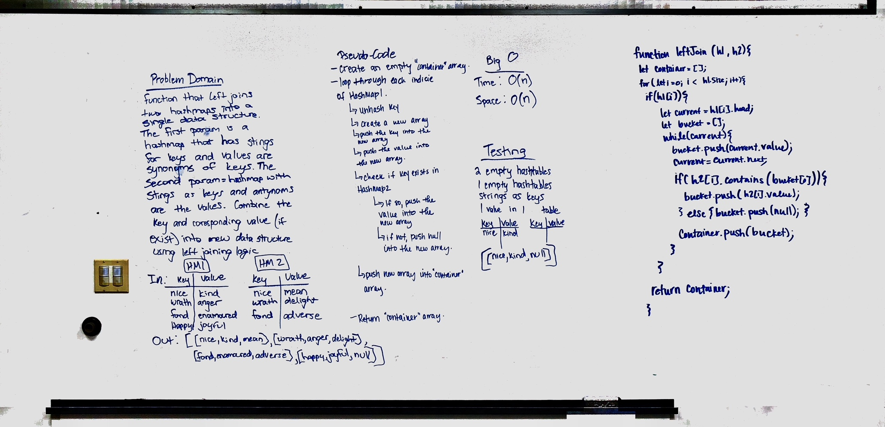

# Hashmap LEFT JOIN

## Challenge
The challenge was to write a function that takes in two hashtables as parameters. Then, return a data structure that contained groupings of the keys and values from the first hashtable along with the values that had the same keys in the second table. If the second table didn't contain the key, add null in its place.

## Approach & Efficiency
We decided to cycle through each index of the first hashtable. If there was a value at that index, we traversed the linked list that was there, pushing the value and the key into an array. Then, before moving on, we checked if that key was in the second table. If it was, we added that value as well. If it wasn't, we added null. Then we pushed that array to the giant container array that would hold all the arrays of keys and values.

## Solution
