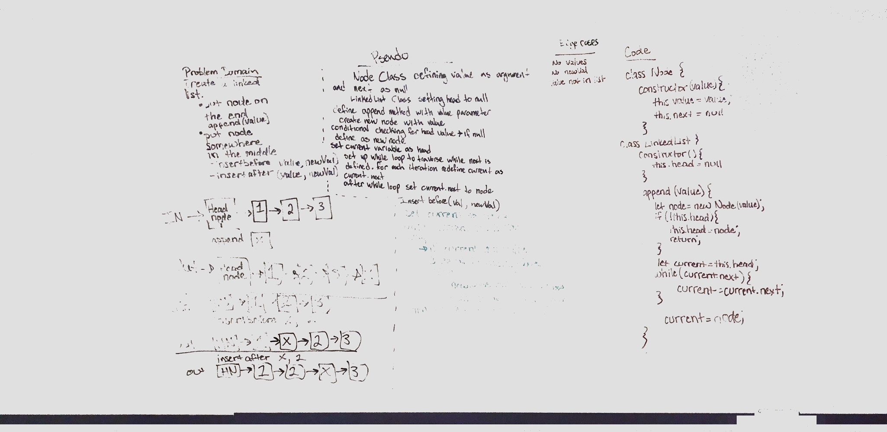
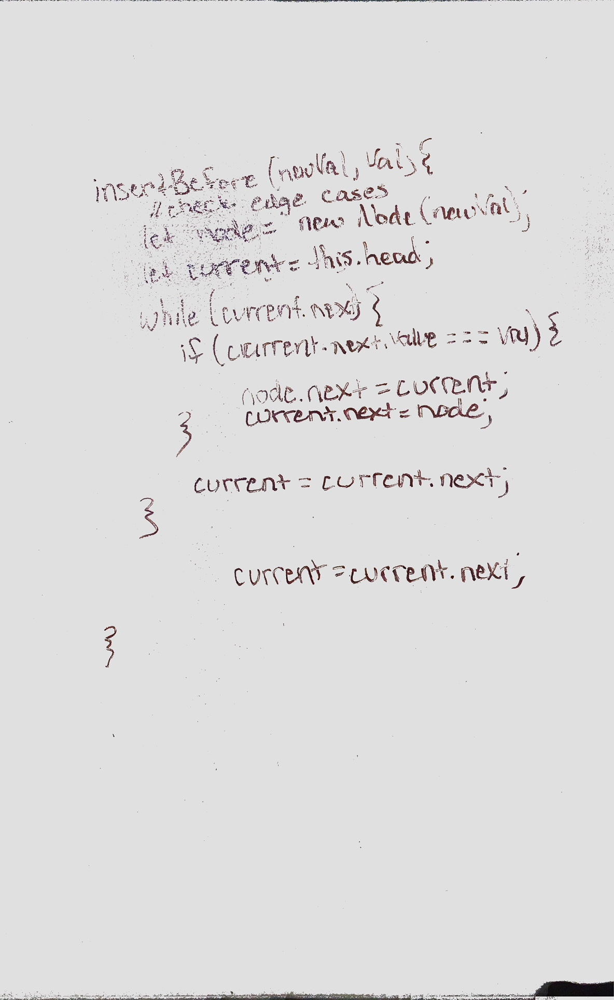
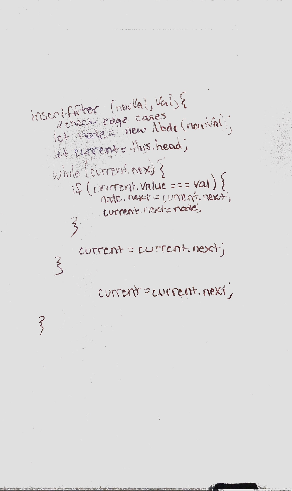

# Singly Linked List
This demonstrates a class constructor of a singly Linked List

## Challenge
The challenge was to create a linked list using classes. Methods on the Linked List include: insert a value to the linked list, search to see if a value exists in a linked list, and print the entire linked list.

## Approach & Efficiency
To add a value to the linked list, I first determine if this is the first value added to the list - if it is, this becomes the head. If it isn't, I loop through the list looking for the value where the next is null. This is the last node. I then set the new value to that next node. The big O for for this apprach is O(n) due to the unknown length of the node list.

To search the list, I apprached the problem very much like I did for adding a value except for this time, I was just trying to match the value of the node rather than add. I still looped through the list to compare so the big O is once again O(n).

To print the list, I loop through the list calculating how long the list is. Then I console log and return the list with that deapth. Again, my big O is O(n) due to the looping of the list of unknown length.

## API
Methods availabe in my linked list:
insert(value) => this method will insert a vale to the end position in the linked list
includes(value) => this method will return true or false based on wether or not the value is included in the list
print() => this method will print the entire list to the console and as a return value 

# Linked List Insertions
Using the Linked List Class, insert a node value

## Challenge
The challenge was to create a method on the Linked List Class to insert a node before a given value and another method to insert a node after a given value.

## Approach & Efficiency
We cycled through the linked list with a while loop (as long as the next was not null). For each itteriation, we checked to see if the target value matched the current value. If it did, we put the node in either before or after the current value and directed the prvious node to point to our new node. We had our new node point to the next node.

The Big O for this approach is O(n) due to the unknown length of the linked list.

## Solution

