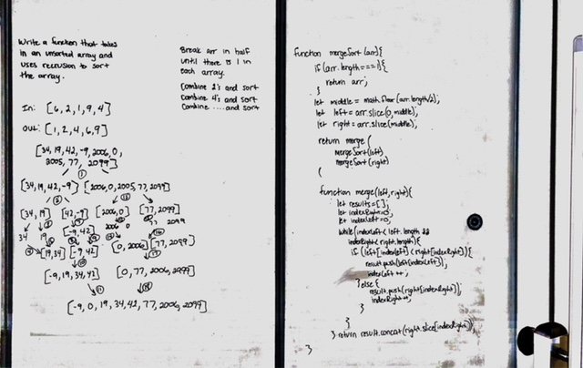

# Mergesort

## Challenge
Write a function that takes in an unsorted array, and - using a recursive mergeSort - returns the storted array

## Approach & Efficiency
I start by cutting the array in half. I do this over and over until I have arrays of only one value each. Then I put them back together and sort them as I do so until I end up with my final array. 

Efficiency is O(log n) for time and space since I cutting the array in half each time.

## Solution
