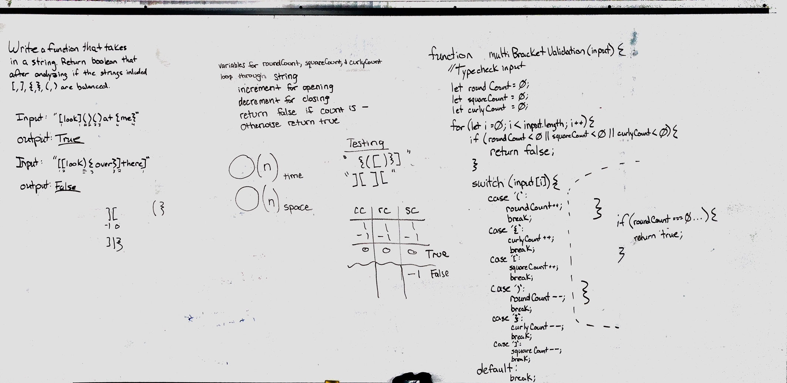

# Multi-bracket Validation.

## Challenge
The challenge was to write a function that takes in a string. Then determine if three kinds of brackets are balanced (opening bracket has a closing bracket with no extras) returning ture or false.

## Approach & Efficiency
We have a counter for each type of bracket. If we encounter an open bracket, the counter goes up. If we encounter a closing bracket, the counter goes down. If the counter finishes at 0, we return true. If at any point, the counter hits negative, it returns false. 

Big O is O(n);

## Solution

