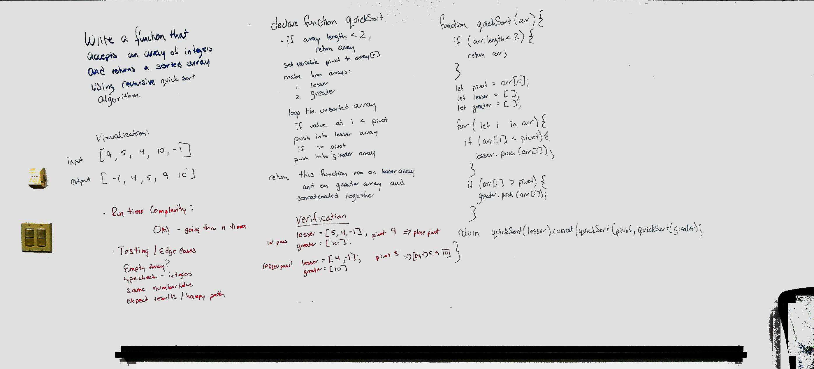

# Quicksort

## Challenge
Write a funciton that takes in an unsorted array and sorts it using a quicksort recursive method.

## Approach & Efficiency
First I picked a pivot point (the first value of a given array). Then, I sorted the rest of the array into two arrays. One that contained values that were larger than the pivot and one that contained values that were less than the pivot. This process places the pivot in the correct index loction. So, I repeated this process using a recursive funciton until everything had been placed correctly. 

## Solution

