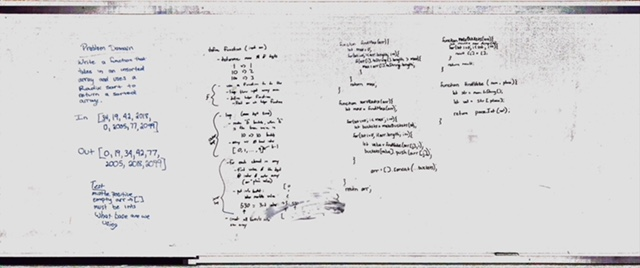

# Redix Sort

## Challenge
Write a funcation that takes in an unsorted array and returns a sorted array using Radix Sort.

## Approach & Efficiency
Step 1: Find the value of the maximum's values digits (ex. 455 => 3)
Step 2: do a loop over the above number. For each value, crate an array that contains 10 empty arrays (assuming we are working in a base 10 system - you can adjust this number if working with a different base);
Step 3: do another, nested, loop over each value of the array and look at the place value of that value at the index of the outer array. 
Step 4: put the value into the array that coresponds to the value of that digit
Step 5: the last step of the outer array will be to reassign the original array to the concated value of the buckets

## Solution

