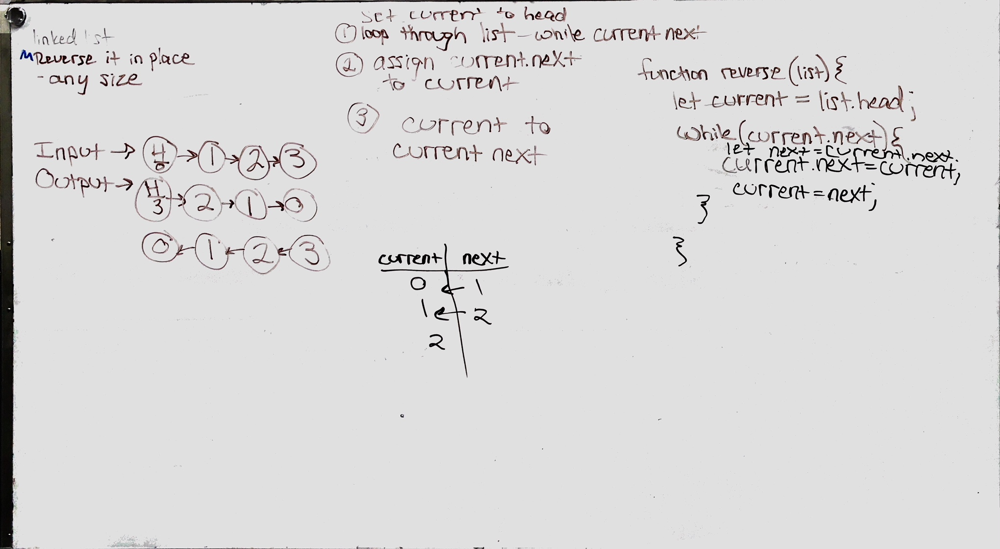

# Stacks and Queues

## Challenge
Write a class for stacks that has three methods: push, pop, and peek.
Write a class for queue that has three methods: enqueue, dequeue, and peek.

## Approach & Efficiency
The Big O for all of my methods was O(1). I didn't ever loop through the list but rather simply added or removed the node.

## API
Stacks:
* push: push takes a value and adds it the top of the stack
* pop: removes the top value from the stack and returns it
* peek: reutrns the top value of the stack without removing it

Queues:
* enqueue: take a value and adds a node to the rear of the Queue
* dequeue: removes the front value of the Queue.
* peek: reutrns the top value of the stack without removing it

# Implement a Queue using two Stacks.

## Challenge
Using only two stacks and the stack methods, write enqueue and dequeue

## Approach & Efficiency
I wrote a method that has an O(1) effiency for both enqueuq() and dequeue()
enqueque(): push the first stack onto the pseudoQ and give it a variable of previous. Next push the second stack onto the Queue and give it the variable of top. Then, assign top.next to previous and previous to top.

dequeue(): push the two stacks onto the Q and then pop the first one off. Easy peasy.

## Solution

