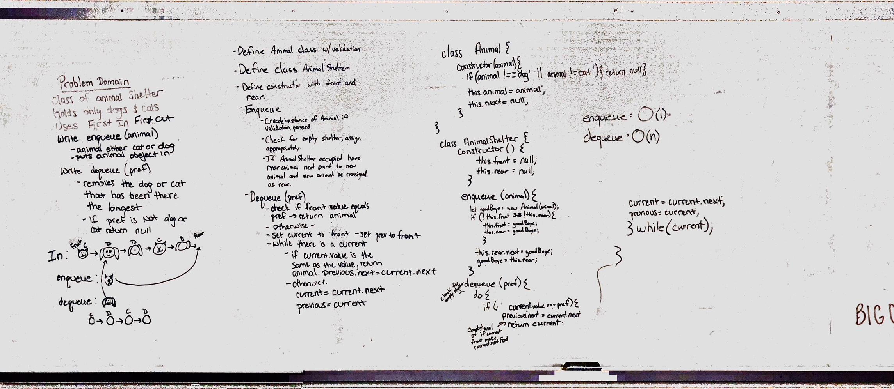

# First-in, First out Animal Shelter.

## Challenge
write a class that has two methods, and enqueue and dequeue. The enqueue should take either a cat or dog and add him to the rear of the animal shelter q. The dequeque should take a prefrence and return the animal of that preference that has been waiting the longest.

## Approach & Efficiency
enqueue: we simply added an animal to the q. If the q was empty, that animal got the pleasure of being both the front and rear animal. Otherwise, that animal became the rear

dequeue: we set up a while loop starting at the front and checking the value of the animal against the prefrence provided. once we found a match, we returned that animal and reassigned the pointers.

## Solution

