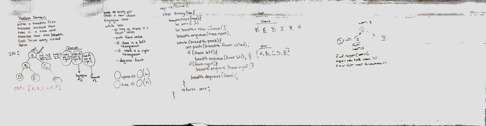
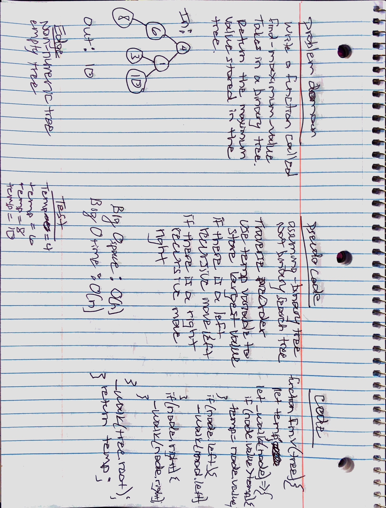

# Trees
Binary Tree and Binary Search Tree

## Challenge
Write a class called binary tree with three methods that will traverse the binary tree. The first method - preOrder() - should traverse the tree left first then right. The second method - inOrder() - should traverse the tree bottom to top, and the last method - postOrder() - should traverse the tree from right to left.

Write a class called binary search tree with two methods: add() - adds a node value, and contains() - returns a boolean if a value exists in the tree

## Approach & Efficiency
I approached these challenges by using a recursive function that moved through the tree in different orders depending on which method was called. 

The big O time for traversing is O(n) since there is no order to the tree
The big O space for traversing is O(h) where h is the height of the tree. 

Since the Binary Tree is an ordered tree, to add a value, I moved right if the value was larger than the node and left if the value is less than the node until i couldn't move any more. Then I inserted the value. To see if a value was contained in the tree, I did the same thing that I did when adding a value except that I compared the values before moving on to see if they matched. 

The big O for time for add and contains is O(log n) since I can quickly move through the tree elminating options as I go. The big O for space is O(1) since it doesn't take up any additional space to look through a tree.

## API
preOrder() - moves through the tree from left to right and returns and array of the path it took
inOrder() - moves through the tree from bottom to top and returns an array of the path it took
postOrder() - moves through the tree from right to left reutrning an array of the path it took
add() - takes a value and adds it to the appropriate place in the binary tree
contains() - takes a value and returns true or false depending on if the value is in the tree
breadthFirst() - traverses a binary tree horizontially by creating a queueing system
findMaximumValue() - traverses a binary tree comparing the values of each node. It returns the largest value.

## solutions

