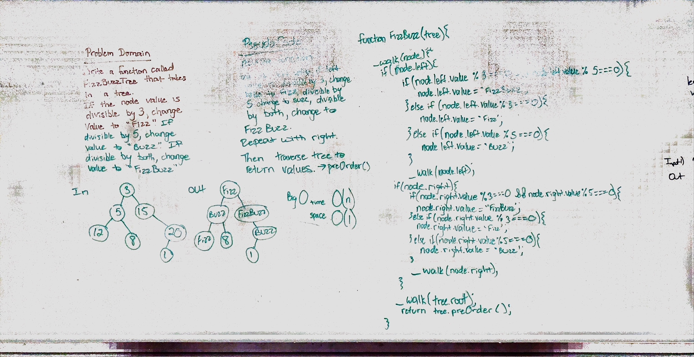

# FizzBuzz Tree

## Challenge
Write a function that takes a tree and changes the values of the nodes on the tree in the following manner:
* if the value is exactly divisible by 3, change to "Fizz"
* if the value is exactly divisible by 5, change to "Buzz"
* if the value is exactly divisible by 3 and 5, change to "FizzBuzz"
return the tree

## Approach & Efficiency
I traverse the tree moving left if there is a left first. Before moivng, I check to see if the value meets the divisibility criteria. If it does, I change the value. I then move right repeating the steps. This is a recursive function that I run until I reach the end. Once there are no more lefts or rights, I traverse the tree with a preOrder to return the values.

## Solution

